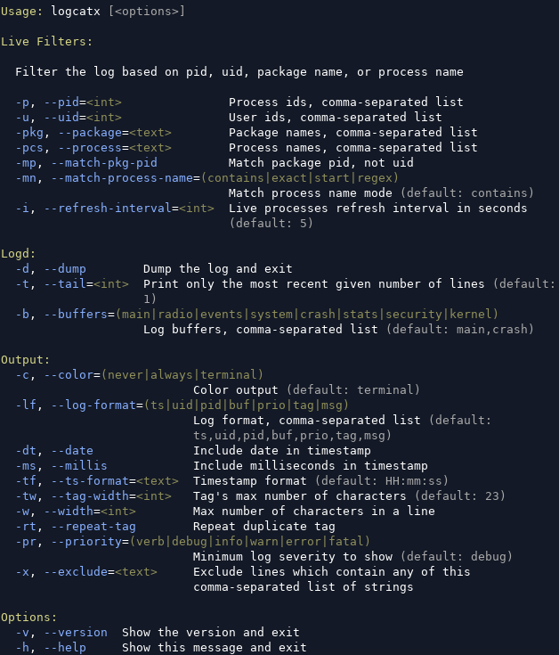
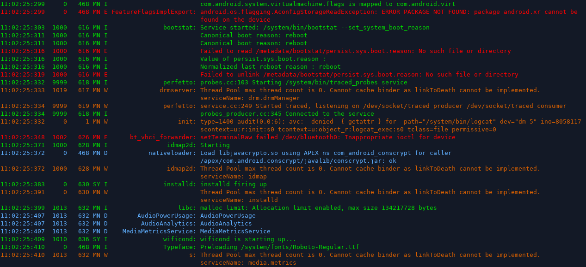

# LogcatX
Filter Android log based on pid, uid, package name, or process name.

It runs a DEX process on Android device which reads directly from logging daemon, not through `logcat` command.

Tested on stock Android 8-16.

```
~$ adb push logcatx /data/local/tmp/
~$ adb shell chmod 0755 /data/local/tmp/logcatx
```

You can define a convenient wrapper function:
```
# ~/.bashrc

logcatx () { 
  if [ $# -gt 0 ]; then
    adb $ADB_OPTS shell -t "exec /data/local/tmp/logcatx $(printf '"%s" ' "$@")"
  else
    adb $ADB_OPTS shell -t "exec /data/local/tmp/logcatx"
  fi
}
```

Or use the complete bash completion file: [logcatx.bash](https://github.com/mirfatif/LogcatX/blob/master/logcatx.bash)

Now simply run `logcatx` with required options. Optionally pass options to `adb`, e.g. a device id:
```
~$ ADB_OPTS='-t 2' logcatx
```

```
~$ logcatx -h
Usage: logcatx [<options>]

Live Filters:

  Filter the log based on pid, uid, package name, or process name

  -p, --pid=<int>               Process ids, comma-separated list
  -u, --uid=<int>               User ids, comma-separated list
  -pkg, --package=<text>        Package names, comma-separated list
  -pcs, --process=<text>        Process names, comma-separated list
  -mp, --match-pkg-pid          Match package pid, not uid
  -mn, --match-process-name=(contains|exact|start|regex)
                                Match process name mode (default: contains)
  -i, --refresh-interval=<int>  Live processes refresh interval in seconds
                                (default: 5)

Logd:
  -d, --dump        Dump the log and exit
  -t, --tail=<int>  Print only the most recent given number of lines (default:
                    1)
  -b, --buffers=(main|radio|events|system|crash|stats|security|kernel)
                    Log buffers, comma-separated list (default: main,crash)

Output:
  -c, --color=(never|always|terminal)
                           Color output (default: terminal)
  -lf, --log-format=(ts|uid|pid|buf|prio|tag|msg)
                           Log format, comma-separated list (default:
                           ts,uid,pid,buf,prio,tag,msg)
  -dt, --date              Include date in timestamp
  -ms, --millis            Include milliseconds in timestamp
  -tf, --ts-format=<text>  Timestamp format (default: HH:mm:ss)
  -tw, --tag-width=<int>   Tag's max number of characters (default: 23)
  -w, --width=<int>        Max number of characters in a line
  -rt, --repeat-tag        Repeat duplicate tag
  -pr, --priority=(verb|debug|info|warn|error|fatal)
                           Minimum log severity to show (default: debug)
  -x, --exclude=<text>     Exclude lines which contain any of this
                           comma-separated list of strings

Options:
  -v, --version  Show the version and exit
  -h, --help     Show this message and exit
```




